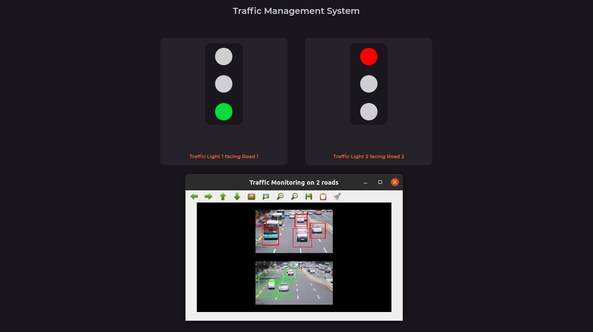
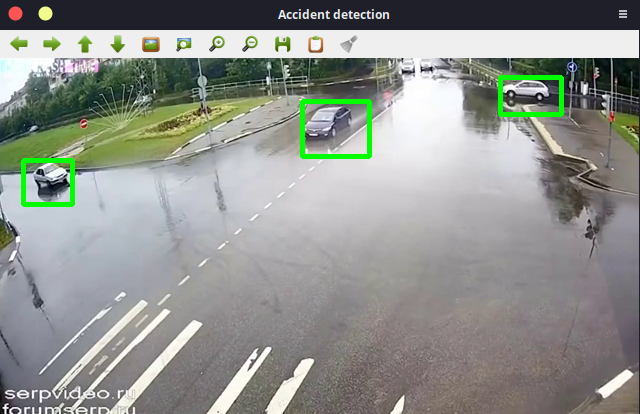
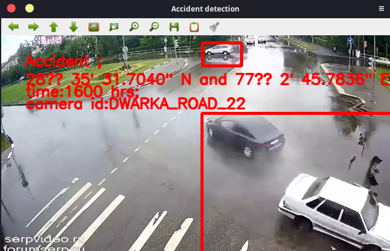

## Team-Novus-Productathon
Collaboration for Productathon. Team Novus.

## Traffic Monitoring Subsytem
The traffic monitoring subsytem monitors the traffic on crossroads and changes traffic lights accordingly. 

#### How to run locally?
- Clone the repo.
- `cd` traffic_monitor
- Install the dependencies: `npm install`
- Execute app.js: `node app.js`
- Visit **localhost:8080** in the browser.

## Accident Detection System
Accident detection subsystem identifies the accident and sends the report to control room (yet to be implemented).

**Before the accident**  

**After the accident**  

#### How to run locally?
- Clone the repo.
- `cd` accident_detection
- Execute the python script: `python accident_detection.py`
